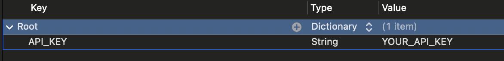

# Weather App
 

  

    Weather iOS Swift App using OpenWeather API
  

## Features

- [x] Current weather updates
- [x] Location-based weather information
- [x] Humidity and wind information

## Requirements

- iOS 17.5 or later
- Xcode 15.4 or later
- Swift 5.8 or later

## Usage
   - Open `Config.plist` in your Xcode project.
   - Replace the placeholder `YOUR_API_KEY` with your actual OpenWeather API Key.
   

